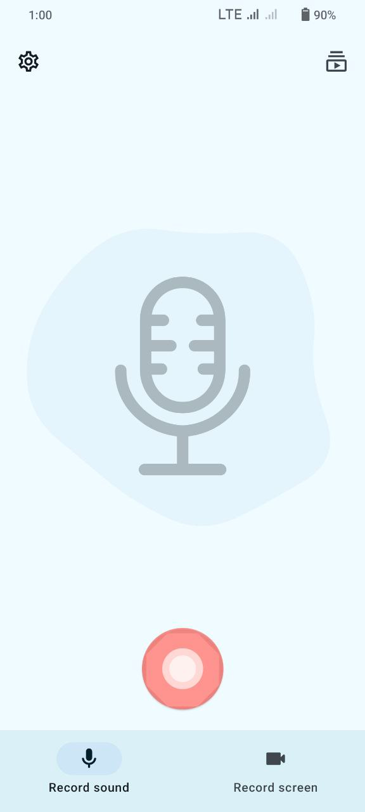

<!-- ---------- Header ---------- -->

  
  <h1>CaptureWave</h1>

Privacy focused voice and screen recorder app built with Material You.

<!-- ---------- Badges ---------- -->
  

    
    
    
     

<!-- ---------- Description ---------- -->

## Features

- [x] Material Design 3 (You)
- [x] Dark and light theme
- [X] Support for audio and screen recording
- [X] Different available formats and codecs
- [X] In-app recordings player
- [X] Predictive back gesture
- [X] SAF (Storage Access Framework) support
- [X] Written in Jetpack Compose

<!-- ---------- Download ---------- -->

## Download

  

<!-- ---------- Screenshots ---------- -->

## Screenshots

  
    
  
  

<!-- ---------- Contribution ---------- -->

## Building the App

***All contributions are very welcome!***

To build the app, you must use Gradle. Its highly recommended to use Android Studio for best
Experience.

## Credits

CaptureWave is a Enhanced App of [Record You](https://github.com/you-apps/RecordYou)

Some of the UI designs and codes are borrowed from [Seal](https://github.com/JunkFood02/Seal)

## License

CaptureWave is licensed under the [**GNU General Public License
**](https://www.gnu.org/licenses/gpl.html): You can use, study and share it as you want.